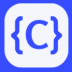

# Code Summarization Tool


<p align="center">
    
</p>

Final Presentation Video Link - https://drive.google.com/file/d/1uauip8CEsvAvflRH6JHCQHHA0yUofBtM/view?usp=sharing

## Overview
The Code Summarization Tool is a comprehensive web application designed to facilitate efficient code comprehension for both users and administrators. It offers two distinct views:

### User View
For users, the tool provides a seamless experience to enhance code understanding and collaboration. Users can:

- **Register/Login**: Access the platform securely to utilize its features.
- **Upload/Input Code**: Input code snippets directly or upload code files for summarization.
- **Select Model and Number of Summaries**: Choose from available models and specify the desired number of summaries to generate.
- **Generate Summaries**: Utilize the tool's summarization capabilities to obtain concise descriptions of code functionality.
- **Rate Summaries Using Feedback**: Provide feedback on the generated summaries, ensuring continuous improvement.
- **View Past Feedbacks**: Access a history of past feedbacks to track progress and maintain consistency.
- **View Average Ratings**: Gain insights into the quality of generated summaries through average ratings.
- **Update Profile Data**: Maintain profile information for personalized user experience.

### Admin View
Administrators have access to additional functionalities for managing users and overseeing feedback data. Admins can:

- **Register/Login**: Access administrative privileges securely.
- **Update Profile**: Maintain profile information for administrative purposes.
- **Add New User**: Expand the user base by adding new users to the platform.
- **Add New Admin**: Enhance administrative capabilities by appointing new administrators.
- **View Feedback Data for Users**: Monitor and analyze feedback data provided by users for continuous platform improvement.

## Technologies Used

The Code Summarization Tool leverages the following technologies:

- **Frontend**: Built using *React.js* for a dynamic and interactive user interface.
- **Backend**: Powered by *Python* with *Flask*, providing robust server-side functionality and RESTful API endpoints.
- **Summarization Model**: Utilizes *OpenAI APIs* for advanced code summarization capabilities, enabling the generation of concise and informative summaries from code snippets.
- **Database**: Utilizes *SQLite* for data storage, offering a lightweight and efficient solution for managing user profiles, feedback data, and other application-related information.

## Setup Instructions
1. **Clone the repository:**
   ```bash
   git clone https://github.com/akshayneema/code-summarization-tool.git
   cd code-summarization-tool

2. **Install frontend dependencies**
   ```bash
   npm install --force

3. **Create and activate a conda environment:**
   ```bash
   conda create --name cs520 python=3.9
   conda activate cs520

4. **Install server dependencies:**
   ```bash
   pip install -r requirements.txt

## Activate App and Server (Use separate command lines)

1. **Activate Python Server:**
   ```bash
   conda activate cs520
   export OPENAI_API_KEY="your_openai_api_key"
   python server/server.py

2. **Start React App:**
   ```bash
   npm start

## Access the Web App

You can access the web application in your browser using the following URLs:

- React app: [http://localhost:3000](http://localhost:3000)
- Python server: [http://localhost:5000](http://127.0.0.1:5000)

## Testing Instructions

To ensure the functionality and integrity of the frontend and backend code, we have included tests for both the Flask backend and the React frontend.

1. **Activate the conda environment:**
   ```bash
   conda activate cs520

2. **Navigate to the project directory:**
   ```bash
   cd code-summarization-tool

3. **Run the pytest command for backend testing:**
   ```bash
   pytest

3. **Run the jest command for backend testing:**
   ```bash
   npx jest
   ```
   
   or
   
   ```bash
   npm test
   ```

## Future Prospects

As the Code Summarization Tool continues to evolve, there are several avenues for future development and enhancement:

1. **Integration of On-premise LLMs**: Explore the integration of on-prem LLMs to reduce its dependence on third-party APIs.

2. **Enhanced Feedback Analytics**: Implement more insightful ways in which the past feedback from the users can be analyzed and incorporated into improving the tool.

3. **Support for Additional Usecases**: In addition to code summarization, include other use cases like syntax error detection, code translation, and many more.

4. **Community Contributions**: Encourage contributions from the developer community through open-source collaboration, allowing for continuous improvement and innovation.


